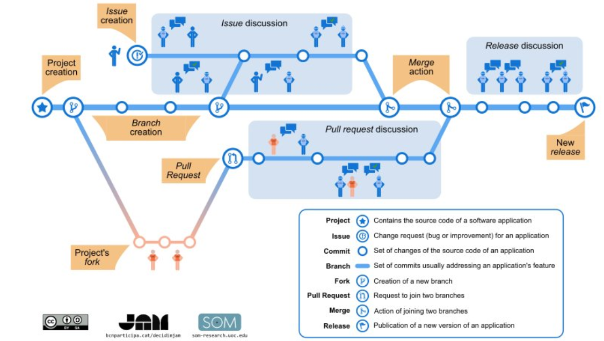
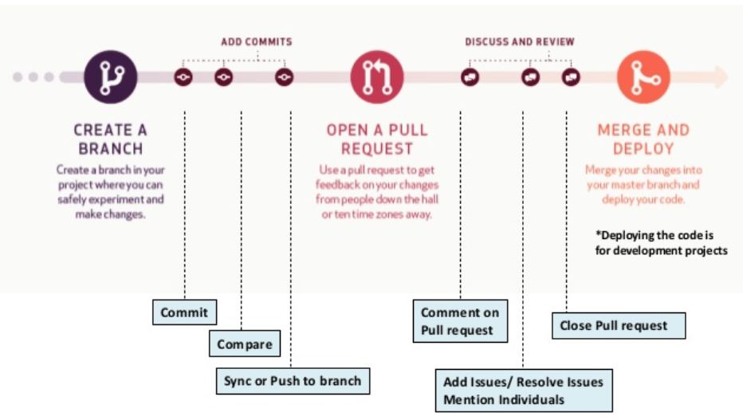
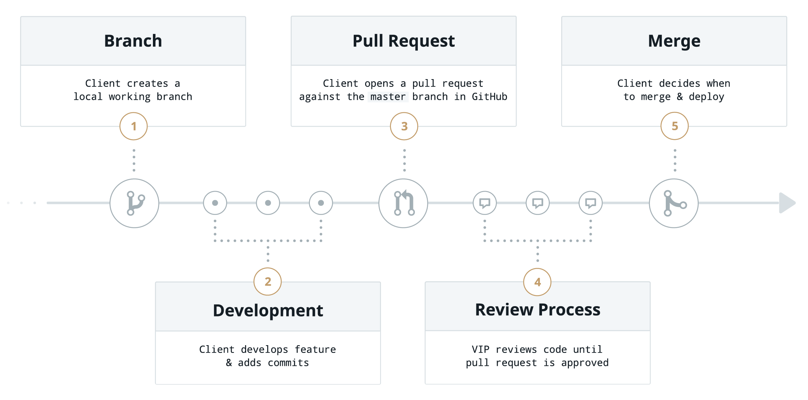

# Mini-Group-Project
## Part 1 

**Cd**: The cd command will allow you to change directories. 
-This is used to go into directories or files. 
-This is done by typing cd space the file you want to go into and pressing enter. 
 
**mkdir**: The mkdir command in UNIX allows users to create directories or folders as they are referred to in some operating systems. (can create multiple). 
-This is used to create a directory or folder to can contain files and etc. This is used to create a folder in the computer drive for storage of files. 
-This is done by typing mkdir space directory name and pressing enter. 
 
**Cp**: This command is used to copy files or group of files or directory. 
-This is used to copy files and for directories, a simple file and other features. 
-The features and synopsis is
(Synapsys types: cp [-R [-H | -L | -P]] [-fi | -n] [-apvX] source_file target_file	
cp [-R [-H | -L | -P]] [-fi | -n] [-apvX] source_file)
 	(Types: -v, -X, -c, -R, -p, -P, -n, -L, -i, -H, -f, -a)
 
**Pwd**: The pwd command is one of the most frequently used commands by Linux system administrators. 
-This is used to see which directory you are in. 
-This is used to see which directory you are in before starting to move things around so you don’t lose track of your location. To do this you must simply type pwd and press enter.
 
**Mv**: The mv command is a command-line utility that moves files or directories from one place to another. 
-This is used to move files or directories from one place to another. 
-This is done by typing mv space source.
(Synopsis: mv [-f | -i | -n] [-v] source target
mv [-f | -i | -n] [-v] source ... directory)
 (Types: -v, -n, -i, -f)
 
**Rm**: rm command is used to remove objects such as files, directories, symbolic links and so on from the file system like UNIX. 
-This is used to removes unwanted files or directories. 
-This is done by typing rm space (types) file name 
(Synopsis: rm [-dfiPRrvW])
(Types: -d, -f, -i,-P, -R, -r, -v, -W )
 
**History**: In Linux, there is a very useful command to show you all of the last commands that have been recently used. The command is simply called history, but can also be accessed by looking at your home folder. 
This is used to see what commands the user typed previously and can scroll through them by using the up and down arrow. 
This is done by typing history in the terminal and it will appear. 

**Home directory and ~**: A home directory, also called a login directory, is the directory on Unix-like operating systems that serves as the repository for a user's personal files, directories and programs. It is also the directory that a user is first in after logging into the system. The tilde (~) is a Linux "shortcut" to denote a user's home directory. Thus tilde slash (~/) is the beginning of a path to a file or directory below the user's home directory. 
-This is used to go back to your pc home user (basically your desktop). Home directory (cd) and cd ~ bring you to the computer’s home directory which is under user/username. 
-This is done by typing cd or cd ~
 
**file paths in Linux**: PATH is an environmental variable in Linux and other Unix-like operating systems that tells the shell which directories to search for executable files (i.e., ready-to-run programs) in response to commands issued by a user. 
-This is used to speed up the process of entering URLs or files. 
-This is done by the drag and drop method. 
 
**Using the tab key to complete file paths**: By pressing tab after typing in a few keys it will automatically open up the first matched file. For example, let’s say you want to run the firefox command. You can just type fir or fire into the terminal and press Tab — if your system doesn’t have any other commands that begin with those letters, Bash will automatically fill in firefox and you can press Enter to run the command. If you press tab twice it will give you options that start with the characters typed. 
-This is used to speed up the process of the command, URL or files on the PC.
-This is done by typing the initial of the command, URL, or file and pressing tab to complete the task. 
 
**Using up and down arrow for history**: The up arrow key allows you to see the previous characters typed in history and allows you to use them instead of repeating. Same with the down key instead of previous it shows the line after.
-This is used to go through the history of commands written previously
-This is done by pressing up and down to scroll through the previous commands.
 

## Part 2 (Haydy Abdalla)

### Gitflow workflow:

 - **Repository:** It is like a "project" and contains all the project files as well as the documentation behind it. It stores every revision made on a file, creating a detailed history for every repository made. It can contain many collaborators and can be either public or private.
   - *For example, if you want to work on a new project, go to github.com and click "create a new repository." Then, create a name, choose a license, and format it as needed as per the requirements of the project*
   
 - **Clone:** This command makes a copy of the repository that is located on your computer. The user can edit the files and use Git to keep track of the changes made without having to be online. It is connected to the remote version so that changes can be synced between the two or the user can push local changes to the remote to keep them synched when they're online.
   
 - **Fork:** Is a command that makes a personal copy of another user's repository and moving it to the user's own account. It allows the user to make changes without affecting the original copy of the program. Forks are always still connected to the original repository so the user can submit a pull request to the original user to add your changes.
   - *You are working on a project with a group. The leader of the group who has created the repository will give you the URL to locate the project on github. You will then click the "fork" button and would then work on the project on the forked version of the repsoitory.*
   
 - **Branch:**  It is a separate copy of the program that is a parallel version of a repository. It allows the user to work on a copy of the program with the assurance that the master branch is not messed with. Afterwards, once the required or needed additions are made, the user can merge the branch they are currently working on with the master branch. By creating a branch, you are creating a copy of the master branch and thus using the latest version saved onto the master branch.
    - *You are working on a project with other people on github. The creator of the repository will have access to the master branch and any changes they make will go straight to it. However other members working on the project will have to create another branch and work on the project from there.*

    
 - **Commit:** A commit is a change or revision to a file(s). Everytime you commit something, it creates a unique id that allows the user to keep track of the changes that were or are being made and by whom and when. It contains a comment section (commit message) that is a short description about the changes made. 
    - *You are working on a project on github, and make some changes. You will scroll down and click the green "commit" button to save your edits. Before you do so, you can also add a message to describe the changes you've made to the project. With every commit, a history log is created with a different id to keep track of the changes being made including information such as by whom and when.*
    
 - **Merge:** A merge is when you take the branch you are currently working on and combine it with another branch.
    - *For example, you are the leader of a project on github. When your group members make changes, it will not go directly to the master branch. They must first send in a pull request, which you must accept, and then merge their changes with the master branch version of the project.*

 - **Checkout:** A GitHub command used to switch branches in a repository.
    
 - **Push:** When you send your committed changes to a remote repository on GitHub.
   - *For example, you work on a repository and change a couple of things. First you have to commit these changes and include a message if you would like. Then, you have to push the changes so that other users can have access to them.*
   
 - **Pull:** When you are bringing in changes and merging them.
    - *For example, if you are a team member of a group project on github but are not the leader of it and thus any changes you make to the project will not be automatically added to the master branch. You will have to create a pull request that the leader must then accept and then merge yoru changes to the master branch.*
    
 - **Remote Add:** Adds a new remote. It takes two arguments: a remote name and a remote URL. Git remote connects the user's local repository to the remote server.
    
 - **Remote Remove:** Removes a remote along with any remote-tracking branches and configuration settings associated with that remote.
    
 - **Remote Show:** This command displays information about the remote name.
    
 - **Status:** A status is a type of status check that are external processes which then run for each commit the user makes in a repository. Status checks allow the user to know if their commits match the condition set for the repository that they are contributing to. The result of a status check can be pending, passing, or failing.
    
 - **Master Branch:** The default branch that should always contain the most currently updated version of code. Before you code, you have to pull the master branch because it contains the latest update of the coding project.
    - *When you create a new repository, any changes you make by default will go to the master branch. If you are working on a forked version of the proejct or have created another branch, then none of your chnages will be added to the master branch by default. You must first commit your changes, create a pull request, then the leader must merge both version, original and edited, together to get the updated version of the project.*
### Sources Used: 
https://help.github.com/en/github/getting-started-with-github/github-glossary
https://www.coredna.com/blogs/what-is-git-and-github-part-two
https://linuxacademy.com/blog/linux/git-terms-explained/
https://help.github.com/en/github/using-git/adding-a-remote

  
## Part 3 (Paulina Ortiz)
 - step one: Go to https://github.com
 - step two: Create your personal account by entering your personal details 
 - step three:To begin working on Github you need to create a project repository.
 - step four: Near the upper right corner click on New repository. 
 - step five: Name the repository as you wish. 
 - step six: Write a brief description on your project.
 - step seven: Then select Initialize this repository with a README.
 - step eight: Share the link to your repository with your group members
 - step nine: Each member needs to fork the project by clicking the Fork button 
 -step ten: Alternatively, members can create a branch by selecting the drop down that reads master branch and entering a name for their branch 
 - step ten: Edit the repository by clicking the edit pen icon 
 - step eleven: Once you are done adding to the README. file, scroll down the page and click on the propose file changes button 
 - step tweleve: From there you must request a pull the request
 - step thirteen: the owner of the project must accept the pull request to commit the changes 

If you group chooses to use branches instead of forking, then the following will help resolve merge conflicts. 
One can use branching to help avoid merge conflicts by structuring the branch tree in advance. A merge conflict occurs when two separate branches have made edits to the same line in a file, or when a file has been deleted in one branch but edited in the other.

For example, the following would create a merge conflict.
If I wrote "one" to the text file and committed it to master branch.
Then if I created a new branch from the master branch and wrote "two" in the file. 
Finally, if I created a third branch from master and wrote "three" in the file.
There will be a conflict when you merge branch 3 to the master branch because both "two" and "three" are written in the second line of the code. Git does not know if you want to keep "three" or "two" so a merge conflict error shows. 
To solve this merge conflict one would go to "pull requests" and click resolve conflicts. From there the conflict will be outlined in red and in this case to solve the conflict, the word "three" in the third branch would have to be written in the third line of code instead of the second or be deleted all together. 

Forking vs Cloning
Forking is a copy of the repository and lets you make edits to the code without affecting the orignial code. Forking is different then cloning because a relationship exists between your fork and the orgnial repository. 
Cloning is when you download a copy of the repository to your computer. Cloning is different than forking because if the project is owned by someone else, you won't be able to make contributions unless you are invited as a collabortor. 
